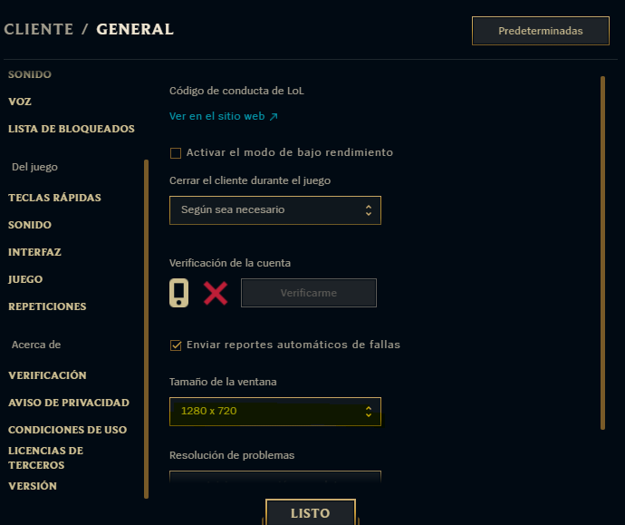
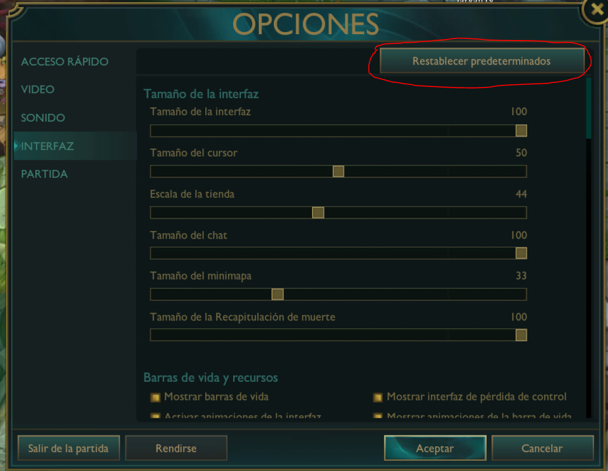
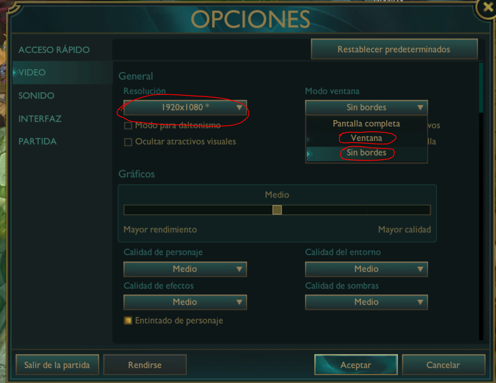
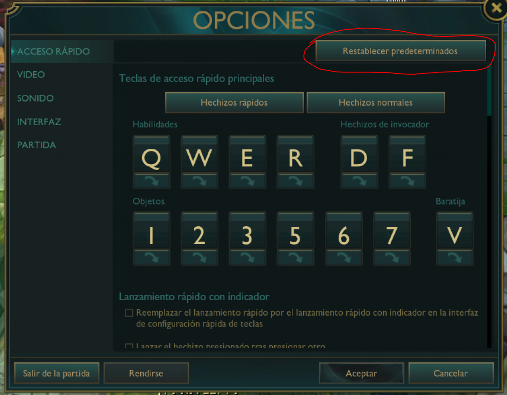
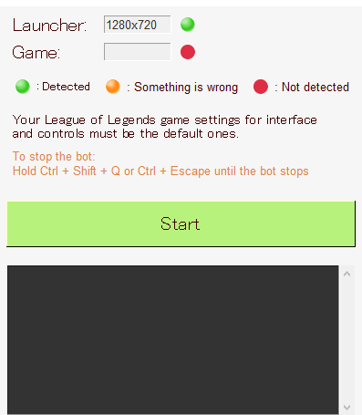

<h1 align='center'>Autolevel Bot for League of Legends</h1>

At the moment, the bot only supports `spanish` language, launcher with resolution of `1280x720`, and game with resolution of `1920x1080`.

### Game settings must be DEFAULT

 
Game should be either `borderless` or `window mode`
 
 

## Instructions

 
Click on `Start` to start the bot, the bot will find its way to find an ai match & play it until the end of times.

Hold `Ctrl`+`Shift`+`Q` or `Ctrl`+`Esc` until the console says `Bot was stopped` to stop the bot.

 
This program is made only for educational purposes.
